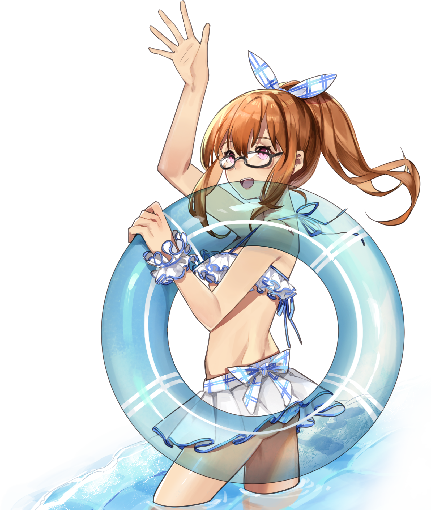

# 女装
**NOTE：本文不一定适合所有人**  
不知不觉女装了10年了，在C97上女装连着4天被意图明显的宅男搭讪，我觉得我还是可以总结出一些东西的。  
先说一下作者在写文章时候的基本身体情况：身高162cm，体重52kg，三围从上到下80/65/84，肩宽35cm。

# 目录

 - [基础知识](#基础知识)
   - [身体](#身体)
   - [搭配](#搭配)
 - [女装搭配](#女装搭配)
   - [Lolita](#Lolita)
   - [JK制服](#JK制服)
 - [失败经历](#失败经历)
 - [结语](#结语)

# 基础知识
长话短说，先说一些基础知识。
## 身体
完整的认知男性与女性身体上的区别有助于更好的女装，**由于作者并不是生物或艺术相关专业，并且没有线下亲眼体会过女性裸体，对于人体的分析全凭自己观察，有可能会有错误的地方，请读者自行斟酌。**  
首先，肥胖/健壮身材的男性不在这篇文章的讨论范围内，也不是说鼓吹一味的追求瘦削，而是作者经验不足无法覆盖到这部分人群。  
如果你还未成年或者身体未发育，请直接跳过本节，作者后悔没有在发育前更多的女装。  
下面是一张来自Wikipedia的成年男女身体对比图
如果你极其瘦削，BMI 17这种，你也可以跳过本节，一瘦遮百丑。

  
全裸警告

这是一般成年男女身体。  
整体上可以看得出，男性的身体更像是倒置的三角烧杯，特征是明显的肩宽，胸腔大，腰部和臀部的曲线非常不明显，身体整体的线条显得坚硬，而女性的身体则正好相反，下面简单的分析一下。

- 肩颈手臂及胸腔  
相较女性，男性的肩和胸腔宽大，肩部成外扩状，三角肌、斜方肌与前臂较发达，锁骨不突出，腋下到腰部分的身体曲线笔直，呈倒三角。这部分的身体线条非常关键，夸张点说这部分决定着女装的成败。特别强调腋下到腰部分的曲线，男性基本上是一个倒三角笔直向下。这部分如果男性特征过于突出或者在衣服的选择上没有很好的掩盖住这部分的男性特征，就很难通过其他手段来进行弥补。  
另外关于手臂，特别强调三角肌最好不要太发达，并且手臂不能有太多赘肉（人称拜拜肉），这会使得手臂显得很粗，一旦手臂粗了，加之男性线条坚硬的特征，就特别有壮汉的感觉。

- 腰部  
女性在肚脐上方到胸部下方部分和肚脐上方到臀部的曲线都是外扩的，而男性还是笔直的。大多数人对于腰部过分追求，但从结果上来说这是本末倒置的，其实腰部并不需要特别要求，只要没有游泳圈就行。

- 臀部、胯部与腿部  
女性的臀部偏大，但从正面上来看最宽的部分在于胯部，接着腿部呈现倒三角形，男性在此相反的基础之上，部分还会有小腿肌肉较发达的情况。胯部也是同样需要注意的地方，在男性肩宽胸腔大的前提下，为了在视觉上给人感觉与女性一致，胯部更需要特别关照。但是在实际操作中有时候可以忽略，一些衣服或者裙子会特意将这部分做大并且有立体感。  

男性身体上的这些特征使得在选择女装的时候需要尤为谨慎。每个人的身体不同，所以对于女装的需要遮盖地方也不同，这里不会展开讲完所有，只会说说作者的一些选择。

### 身体视觉曲线的处理
在处理这个问题的时候，关注点应该在肩手臂以及臀部胯部，让人在视觉上感到胯宽≥肩宽而不是相反，这样看上去身体的曲线会与女性相似。而男性的壮实感很大程度来源于上肢，上肢尽量不能肥胖或者肌肉明显，这样处理起来会简单很多，重点强调最好不要有明显拜拜肉。  
不过对于肩宽作者有一个办法可以进行掩盖，就是在胸部位置增加起伏，如果注意观察的话会发现，一些胸部位置有起伏的女性肩宽会稍微宽一些，这样可以尽可能地接近同样身材的女性，同时也可以转移注意力，让对方关注不到其他地方的问题。当然起伏不要太过分。  
男性身体的优势在于下身，只要不是太过分，没有多余赘肉的长腿是很多女性梦寐以求的，在处理的时候可以将这一部分的优势充分发挥。

## 搭配
穿着搭配属于非常个性化的问题，所以这部分内容读者可以仅作参考。  
在作者看来，穿着搭配也是有基础知识的，不过很简单，只要搭配能成一个完整的风格套装就行，比如港风日系。不过混搭也经常会有形成一个独立风格的时候，这里保守起见推荐遵循现有的风格，这是上手成本极低也非常安全的。同时也有一点需要注意的是，选择适合自己的风格，不仅是身材上的适合，也要适合性格，让自己穿着舒适。至于如何判断风格是否适合自己，作者也不是专业人士，就不下判断了。  
进一步的搭配知识大家可以在网络以及各类杂志上了解，这里作者就不做任何推荐了。但是还是希望读者能够了解更多的知识。  
作者在选择搭配时还会尽量只把重点放在上身或下身，强调主次分明，读者可以参考斟酌。

# 女装搭配
由于女装风格种类繁多，仅对作者熟悉的部分风格的女装做一些分析，同样，**作者并非专业时尚人士或服装设计，对于女装的分析全屏自己观察，有可能会有不到位甚至错误的地方，请读者自行斟酌**。  
Cosplay并不在本文的讨论范围内。

## Lolita
Lolita由于其文化在国内的特殊性，受众群体也覆盖到了男性身上。不过其实Lolita对于男性身体来说是比较难驾驭好的，在一些设计上甚至对于身材的要求非常高，以至于女性都不一定能穿着漂亮，所以在衣服的选择上需要非常谨慎。  
说一些常见会遇到的坑，读者可以在选择的时候关注这些潜在的问题。  

- 泡泡袖+蕾丝边/褶边  
衣袖宽大的设计考验的是上身的体型，泡泡袖和蕾丝边/褶边的搭配要求更高，露肩在一定程度上可以削减对于体型的要求，但是对于肩和锁骨以及胸腔这一部分的要求又会非常高。前文分析的男性的身材在上身部分非常吃亏，这样的设计会显得上身更加宽大，偏胖穿着会显得更壮，偏瘦穿着也许会有其他问题，下文会提及。所以在选择这样的衣服的时候需要谨慎。
- 露肩  
如同上文所说，男性肩膀与女性是由区别的，露肩的衣服对于肩膀有非常高的要求，而部分设计还会露出部分手臂和腋下，如果不是对自己的上身身材非常的自信，在选择这类衣服的时候也请谨慎。
- 不收腰  
这一点可以仁者见仁智者见智，收腰的设计相对来说会帮助更好的处理身体曲线，下身的裙子可以展开但是又不至于太过大，不收腰的设计裙子会展开的非常大，很容易显得胖，上肢瘦削的情况还勉强，上肢稍微强壮一点的话就会显得整个人非常胖。

这些是常见的会遇到的问题，读者可以进行参照。  
而Lolita这个大分类下可以有更多的小分类细分，读者可以参考[Wiki](https://ja.wikipedia.org/wiki/%E3%83%AD%E3%83%AA%E3%83%BC%E3%82%BF%E3%83%BB%E3%83%95%E3%82%A1%E3%83%83%E3%82%B7%E3%83%A7%E3%83%B3#%E3%83%AD%E3%83%AA%E3%83%BC%E3%82%BF%E3%83%BB%E3%83%95%E3%82%A1%E3%83%83%E3%82%B7%E3%83%A7%E3%83%B3%E3%81%AE%E7%A8%AE%E9%A1%9E)。甜系应该是国内非常流行的一个分类，这个分类下的衣服设计很多会遇到上文所提及到的潜在问题，而且甜系对于高大男性来说还有非常有难度的，所以在选择的时候需要谨慎。朋克Lolita在部分衣服的设计上会偏向中性，而王子Lolita设计的出发点就是中性风格，相较于其他分类，这两种的驾驭难度要小不少。

作者在Lolita衣服的选择的时候非常偏好带有斗篷的衣服，这样可以在肩宽不过分的前提下，尽量的遮盖住上身的宽大。同时衣服也需要是收腰，这样整体来看上身与女性的区别就会小很多。

说完了衣服，接下来该说穿着的时候需要注意的一些潜在问题，但是这一部分**主观成分非常大，请读者认真自行斟酌**。

- 体态  
一些男性有着驼背、头部前倾之类的体态问题，这一点很容易被服装放大，不仅会显得身体更加粗壮，衣服也穿不出应有的气质。至少在穿着衣服的时候抬头挺胸，将Lolita应有的气质展现出来，Lolita也是有一定气质的要求。如果不知道该怎么做，可以在胸口一直含着一口气。
- 版型  
Lolita以裙装为多，一些衣服的材质并不足以独立支撑起衣服的版型，大部分是需要裙撑或者一些辅助道具，缺少这些辅助道具穿起来就显示不出衣服该有的版型，就像上文所说的，偏瘦的人群在没有辅助道具的帮助下穿着衣服，衣服就像一个浴巾一样挂在身上，浪费了衣服应有的美。

注意这些潜在问题可以让穿着衣服的时候的违和感减少，读者可以根据自己的情况参照。

Lolita服装对于男性来说有一定的难度，但是正因为这个难度，所以才有挑战的价值。希望各位读者都能够达到完美。

## JK制服
JK制服总体来说变数比Lolita要少，主要分为两大类：西式制服和水手服，往下细分还可以分为冬服和夏服。不管是哪种分类都有一个明显的特点：短裙，这可以将男性下身修长的腿部展现出来。JK制服对于身体的要求也比Lolita要低，总的来说难度要小不少，JK制服对于男性最大的障碍就是男性较宽的上身，肩宽比例不协调，加之JK制服对于腰部和胯部的处理较少，所以肩宽很难通过其他方式进行掩盖。  
这里将西式制服和水手服分开来讲解。

- 西式制服  
西式制服上身为衬衫领结，可以搭配针织衫和外套，有些会做一些收腰处理，也有一些和普通的男装区别不是很大，所以上身部分只要不是肩宽特别宽或者上肢特别发达，穿起来和女性的区别并不是特别大，需要处理的是下身，不过还是建议在胸部的位置有一点起伏，正如上文所说，男性上身较宽，加之衬衫和针织衫没法很好的遮盖住上身宽的的特点，如果是一马平川下来再加上宽广胸怀，很容易让人引起思考，在胸部增加起伏可以让人第一眼不容易看出来，同时也可以使得衣服更加修身。  
下身的裙子是需要稍微注意的地方，JK制服裙很少有对胯部以及臀部进行特殊处理，男性在穿上之后胯部会小于肩部。
- 水手服  
水手服同样也少有收腰处理，但是水手服上身较短，使得视觉上整体的腰线要比西式制服要高不少，水手服上身的衣襟和领巾可以掩盖住上身宽大，不过裙子也没有对胯部和臀部特殊处理，穿上后胯部小于肩部的问题依然存在。

夏季制服比起冬季制服来说要注意的事情更多，夏季制服很容易体现出上身的宽大，而冬季制服可以通过外套或者牛角扣大衣来直接对整个身体曲线进行遮盖，只留下男性修长的腿部。

JK制服在穿着的时候需要注意的地方并不多，如果下身穿的不是连裤袜而是长筒/中筒/短袜的话，注意一下腿毛的清理工作，或者穿一层打底的肉色连裤袜。如果对于腿部没有自信，比如说有点结实，可以使用黑色连裤袜。

总的来说，JK制服对于男性来说难度要小不少，但是也是有一些小小的挑战的。

# 失败经历
也算是总结一下作者走过的弯路，希望能对读者有所帮助。  
- 在买单品的时候没有考虑全身搭配，每件单品单独开来都很好看，但是穿在一起就有很大的违和感。
- 选择衣服时以男性的眼光去选择了，最后效果非常差，选择衣服必须要以女性的眼光来看，这一点作者也不知道该如何详细讲解。
- 同样还是选择衣服，没有考虑衣服的实际情况和自身的实际情况，想当然的以为很上身，结果惨不忍睹。
- 女装的时候化妆不好也没带口罩，被路人以另类眼光打量了一身。
- 穿常服时高跟鞋太高/太响路人都在看。
- 穿了不适合自己风格的一套衣服，一天下来人非常累。

# 结语
最后希望各位读者都能够达到完美的女装，也希望自己能够有朝一日能够像朝陽一样穿着泳装在海边玩耍  

